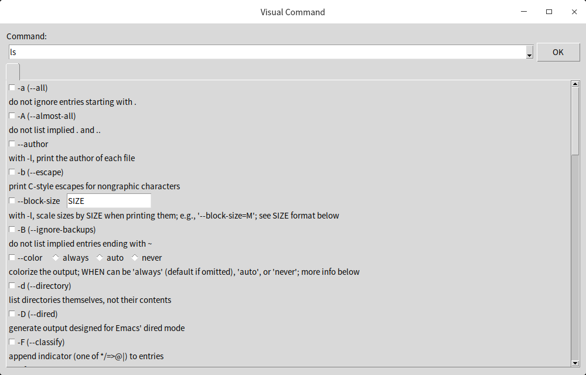

# viscmd

[中文在这里](README_zh-CN.md)

## Introduction

Viscmd is short for Visual Command, which is intended to make typing some Linux commands convenient. 
It provides a graphical user interface that visualizes the arguments of a command, accepts user's
input in-place, then generates a complete command line.

Features:
- supports bash and zsh
- completion mode and run mode
- argument grouping
- builtin types (file, directory, netdev, etc...)
- multi-language for command definition
- command version matching
- complex argument

## Installation

Developed on Deepin GNU/Linux 20.4, should work on many recent linux distros.

1. Make sure you solve the dependencies:
- bash (5.0.3 tested)
- zsh (5.7.1-1 tested, optional)
- Python3 (3.7.3 tested) 
- python3-tk (3.7.3 tested) 

For Debian/Ubuntu: 
```shell
apt install -y python3-tk
```

2. Clone or download this repository.
```shell
git clone https://github.com/viscmd/viscmd.git
```

3. Run `install.sh` as root.
```shell
cd viscmd
sudo bash install.sh
```

4. Clone the viscmd/data repository:
```shell
git clone https://github.com/viscmd/data.git /var/lib/viscmd
```

## How to use

### Completion mode

When we are already in bash/zsh, type any supported command(see the viscmd/data repo), then hit SHIFT-TAB. For example: 

```shell
$ ls <SHIFT-TAB>
```

A dialog would pop up:


After we finish filling some argument in the dialog, please click the OK button. 

We could see the command completion in bash/zsh is done. 

Of course, we need an ENTER to run the completed command line.

### Run mode

Invoke the command `viscmd` directly. The OK button becomes Run button. It will call `gnome-terminal` 
or `deepin-terminal` to run the command.

## Questions and Answers
### What it does not
- Does not parse a command line with arguments already provided.
- Does not validate the entered argument values.
- Does not check constraints on arguments.

### Does it support macOS?
Possibly No. I don't have a Macbook.

## How to contribute

[Please read this.](CONTRIBUTING.md)
